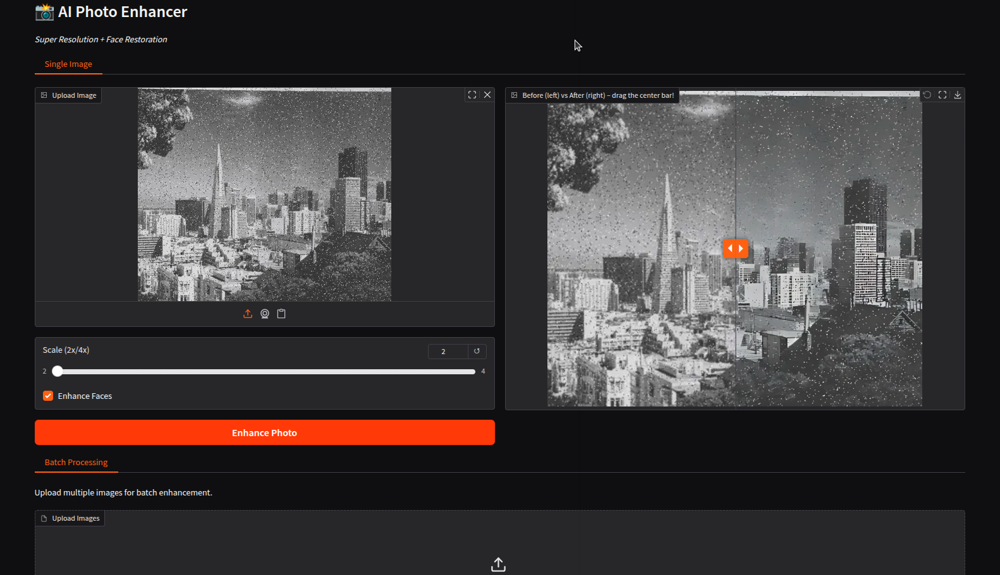

# AI Photo Enhancer
[](https://github.com/dronefreak/ai-photo-enhancer)

A fast AI-powered photo enhancer using Real-ESRGAN and GFPGAN for super-resolution and face restoration.

 <!-- optional -->

## Features
- 2x / 4x Image Upscaling
- Noise & Artifact Reduction
- Face Enhancement via GFPGAN
- Batch Processing
- Simple Web Interface (Gradio)

## Run Locally

```bash
git clone https://github.com/yourname/ai-photo-enhancer.git
cd ai-photo-enhancer
conda create -n ai-photo-enhancer python=3.10 -y
conda activate ai-photo-enhancer
pip install -r requirements.txt
python app.py
